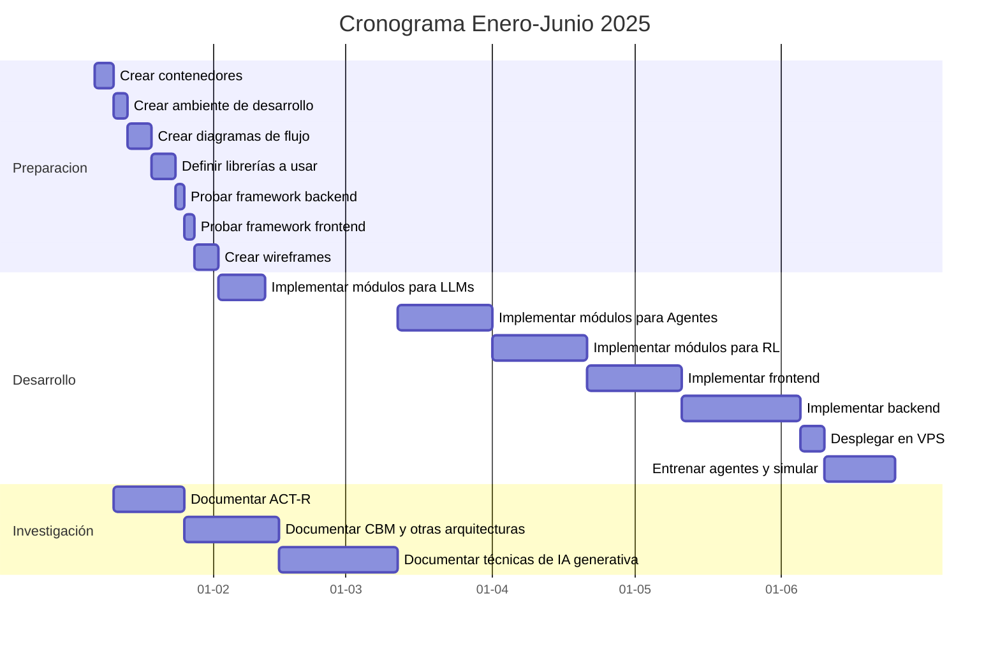
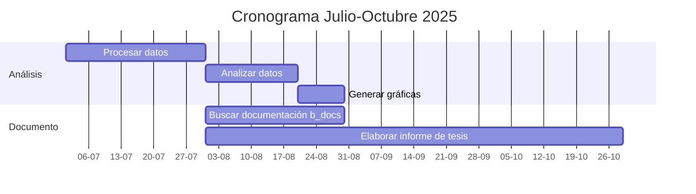

### Maestría en Ingeniería, Ciencia y Tecnología

#### Seminario 1

# Título
Incidencia de la Inteligencia Artificial Generativa en Sistemas de Tutores Inteligentes

# Nombre del estudiante y nombre del tutor

## Director
Edgar José Andrade Lotero

## Codirector
Daniel Bojacá

## Estudiante
Jairo Vladimir Tamayo Ramirez

# Definición del Problema (y Justificación)

Pedro es un niño tímido a quien le gustan las matemáticas. Actualmente cursa el grado noveno, pero últimamente no participa mucho en clase. Todo esto comenzó a raíz de que, hace algunas semanas, se interesó por profundizar en un tema. Durante la clase de matemáticas, le pidió ayuda al profesor con un problema que había despertado su interés. Sus compañeros empezaron a hacerle comentarios ofensivos porque pensaron que les asignarían más tarea. A pesar de que el caso de Pedro es hipotético describe una realidad que afecta a una gran cantidad de personas durante sus procesos de aprendizaje, esto sumado a las difíciles condiciones del entorno educativo colombiano que empeoraron durante la pandemia de Covid-19 como la falta de acceso o acceso precario a Internet, poco conocimiento en el manejo de herramientas tecnológicas y la carencia de hábitos de aprendizaje autónomo [^1].

La ONU afirma [^2] en los objetivos de desarrollo sostenible que "se estima que en 2030 unos 300 millones de niños y jóvenes seguirán careciendo de conocimientos básicos de aritmética y alfabetización", lo cual pone de manifiesto que las problemáticas asociadas con la educación no son específicas del entorno colombiano. Esto demuestra la necesidad de impulsar la creación de herramientas que permitan el acceso a educación de calidad a bajo costo. Desde el año 2022, se ha observado un gran crecimiento tanto en el desarrollo como en el uso de grandes modelos de lenguaje (LLM) para realizar tareas para las cuales no fueron inicialmente concebidos, las llamadas "habilidades emergentes". Esto permite pensar que los grandes modelos de lenguaje pueden tener aplicaciones en educación. El presente proyecto busca determinar cómo la inteligencia artificial generativa puede contribuir al desarrollo de sistemas de tutores inteligentes de una forma económica y aplicable en una amplia variedad de entornos, sin pretender reemplazar a los tutores humanos. Además, cabe destacar que la efectividad de los tutores personalizados en procesos de aprendizaje ha sido evidenciada desde hace varias décadas[^3], pero debido a los altos costos de un tutor humano, se hace muy difícil que la gran mayoría de los estudiantes puedan acceder a este tipo de tutorías.

# Objetivos del Trabajo

## Objetivo General

Generar un marco de trabajo para mapear las funcionalidades principales de los tutores inteligentes en un sistema de agente autónomo que incluye un grandes modelos de lenguaje y aprendizaje por refuerzo.

### Objetivos Específicos

- Identificar, de manera general, las funciones principales de los tutores inteligentes.
- Desarrollar una solución basada en software que implemente las funciones principales de los tutores inteligentes mediante técnicas de inteligencia artificial generativa.
- Adaptar la técnica de aprendizaje por refuerzo con retroalimentación humana para entrenar a un agente a través de la interacción con grandes modelos de lenguaje, cuyo objetivo sea encontrar una política que minimice el tiempo de aprendizaje.

# Estado del Arte

Para el presente trabajo, se hace necesario dividir en dos grupos: por un lado, tenemos los modelos que permiten entender cómo aprenden los humanos; y por otro lado, las herramientas tecnológicas que forman parte de todo lo relacionado con la inteligencia artificial generativa.

##  Control Adaptativo del Pensamiento—Racional (ACT-R)

La investigación de tutores inteligentes se considera [^4] como un dominio de la arquitectura cognitiva ACT-R la cual sirve para modelar los procesos de aprendizaje permitiendo su optimización. En esta arquitectura se distinguen 2 tipos de conocimiento: declarativo y procedimental.

## Modelado Basado en Restricciones (CBM)

## Tutores inteligentes

## LLMs (Large Language Models)

## Uso de LLMs para el Desarrollo de Tutores Inteligentes

## RAG (Retrieval-Augmented Generation)

## Agentes

# Propuesta Metodológica
- Diagrama de flujo
- Etapas
- Requerimientos
- Exploratoria
- Procedimientos análisis/ interpretación de resultados
- Cualitativa? cuantitativa? mixta? -> como se recopilan y analizan los datos
- Mejor selección de problemas para optimizar el proceso de aprendizaje usando aprendizaje por refuerzo
- Descomposición en conjuntos de subtareas mas simples dependiendo del estudiante
- Entrenar agente para que presente un mejor conjunto de instrucciones
- 

# Cronograma de Trabajo para Tesis 1

# Cronograma de Trabajo para Tesis 2

# Presupuesto

A continuación, se listan los elementos necesarios para llevar a cabo el presente proyecto, incluyendo su cantidad y costo estimado. La totalidad de los costos será asumida por el investigador.

| Elemento | Cantidad | Precio (COP) | Tiempo de uso | Total |
| -------- | -------- | ------------ | ------------- | ----- |
| Computador | 1 | 3'500.000 | 3 meses | 3'500.000 |
| Desarrollo de Software | 1 | 80.000/hora | 400 horas | 32'000.000 |
| Servidor virtualizado | 1 | 70.000/mes | 3 meses | 210.000 |
| OpenAI API gpt-4o input | 2'000.000 tokens | 5.400/1'000.000 tokens | N/A | 10.800 |
| OpenAI gpt-4o API otput | 4'000.000 tokens | 43.200/1'000.000 tokens | N/A | 172.800 |
| OpenAI API gpt-4 turbo | 2'000.000 tokens | 43.200/1'000.000 tokens | N/A | 86.400 |
| Replicate API meta/meta-llama-3-8b-instruct input & 2'000.000 tokens | 2.160/1'000.000 tokens | N/A | 4.320 |
| Replicate API meta/meta-llama-3-8b-instruct output | 2'000.000 tokens | 10.800 | N/A | 21.600 |

Total 36'005.920 COP

# Bibliografía
[^1]: VisDificultadesMonteroMahecha_2021
[^2]: ONUObjetivos_2030
[^3]: TheSigmaProblemBloom_1984
[^4]: Anderson_act_1990

# Palabras Clave
Intelligent tutor system, Model tracing approach
